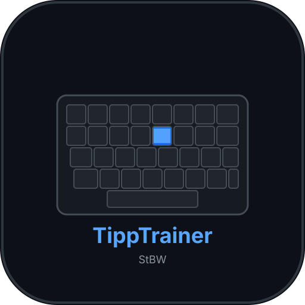
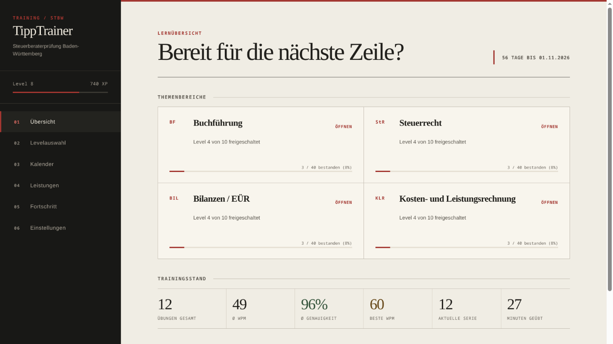
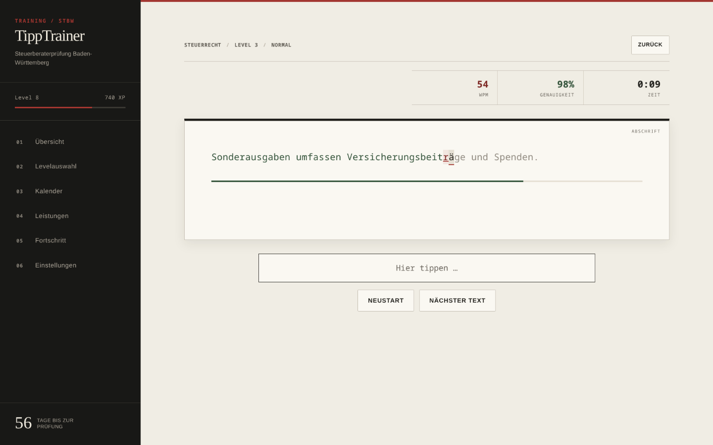

<p align="center">
  
</p>

<h1 align="center">TippTrainer StBW</h1>

<p align="center">
  Offlinefähiges 10-Finger-Training mit Fachtexten zur Steuerberaterprüfung in Baden-Württemberg.
</p>

<p align="center">
  <a href="https://github.com/Gr33n93/TippTrainer-StBW/actions/workflows/lint.yml"></a>
  <a href="https://github.com/Gr33n93/TippTrainer-StBW/releases/latest"></a>
  <a href="LICENSE"></a>
</p>



TippTrainer StBW verbindet klassisches Tipptraining mit Begriffen und Texten aus Buchführung,
Steuerrecht, Bilanzen/EÜR sowie Kosten- und Leistungsrechnung. Die Anwendung läuft vollständig
lokal: im Browser ohne Installation oder unter Linux als AppImage.

> [!IMPORTANT]
> Dieses Projekt ist eine unabhängige Lernanwendung. Es ist weder mit einer Steuerberaterkammer
> noch mit der Steuerberaterprüfungsstelle Baden-Württemberg verbunden und ersetzt keine Steuer-
> oder Rechtsberatung. Fachliche Inhalte können veralten und sollten mit aktuellen amtlichen
> Quellen abgeglichen werden.

## Funktionen

- 4 Themenbereiche mit jeweils 10 aufeinander aufbauenden Leveln
- 4 Schwierigkeitsstufen mit eigenen Zielwerten für Tempo und Genauigkeit
- 1.940 Übungstexte in 160 Auswahlpools, jeweils ohne interne Dubletten
- Live-Auswertung mit WPM, CPM, Genauigkeit und Zeit
- XP, 32 Leistungen und Freischaltung weiterer Level
- Übungskalender, Serien und ausführliche Fortschrittsstatistik
- Prüfungstermin mit lokal berechnetem Countdown
- Export und Import des vollständigen Lernstands als JSON-Datei
- Responsive Bedienung per Maus, Tastatur oder Touch
- Kein Konto, kein Backend und kein Tracking

## Download und Start

### Linux-AppImage

Die aktuelle Ausgabe steht unter [Releases](https://github.com/Gr33n93/TippTrainer-StBW/releases/latest)
bereit. AppImage und `SHA256SUMS.txt` in dasselbe Verzeichnis herunterladen und anschließend prüfen:

```bash
sha256sum --check SHA256SUMS.txt
chmod +x TippTrainer-StBW-*.AppImage
./TippTrainer-StBW-*.AppImage
```

Das AppImage ist für Linux auf x86-64 gebaut und benötigt keine systemweite Installation.

### Im Browser

```bash
git clone https://github.com/Gr33n93/TippTrainer-StBW.git
cd TippTrainer-StBW
python3 -m http.server 8000
```

Danach `http://localhost:8000` aufrufen. Alternativ lässt sich `index.html` direkt öffnen. Der
Lernstand des Browsers und der Desktop-App wird getrennt gespeichert; über Export und Import kann
er übertragen werden.

## Oberfläche



Das Prüfungsatelier setzt auf ruhige Papierflächen, eine klare redaktionelle Typografie und einen
konzentrierten Schreibbereich. Tabellen, Diagramme und Kalender bleiben auch bei schmalen
Bildschirmen bedienbar.

## Technik und Entwicklung

Die Web-Anwendung besteht aus HTML, CSS und Vanilla JavaScript. Sie hat keine Laufzeitabhängigkeiten
und kommuniziert nicht mit externen Diensten. Electron dient ausschließlich als Linux-Desktop-Hülle.

Für Entwicklung und Tests wird Node.js 22.22.2 oder neuer benötigt:

```bash
npm ci
npm test
npm run test:coverage
npm run verify
```

Die Testsuite umfasst mehr als 160 automatisierte Node-Prüfungen. In der CI kommen separate
Electron-Tests für responsive Ansichten, echte Klicks, Zoom und den Start des gebauten Pakets hinzu.

Weiterführende Dokumentation:

- [Architektur](ARCHITECTURE.md)
- [Änderungsverlauf](CHANGELOG.md)
- [Beitragen](CONTRIBUTING.md)
- [Sicherheitsrichtlinie](SECURITY.md)

## Daten und Browser

Fortschritt, Einstellungen und Leistungen liegen ausschließlich im lokalen Speicher der jeweiligen
Anwendung. Beim Löschen der Browser- oder App-Daten geht der Lernstand verloren, sofern zuvor kein
Export erstellt wurde.

Die Anwendung ist für aktuelle Browser mit modernen Web-APIs ausgelegt. Automatisiert geprüft werden
die Geschäftslogik, die DOM-Integration und die Electron-Oberfläche; eine vollständige
Mehrbrowser-Matrix besteht derzeit nicht. Das Training ist auf ein deutsches QWERTZ-Layout
zugeschnitten.

## Mitmachen und unterstützen

Fehler und konkrete Verbesserungsvorschläge sind als
[Issue](https://github.com/Gr33n93/TippTrainer-StBW/issues) oder Pull Request willkommen. Hinweise zur
lokalen Einrichtung und zum Review-Ablauf stehen in [CONTRIBUTING.md](CONTRIBUTING.md).

Wenn dir TippTrainer StBW beim Lernen hilft, kannst du Pflege und Weiterentwicklung freiwillig auf
[Ko-fi](https://ko-fi.com/nilsarnold) unterstützen.

## Lizenz

Veröffentlicht unter der [MIT-Lizenz](LICENSE). Copyright © 2026 gr33n93.
